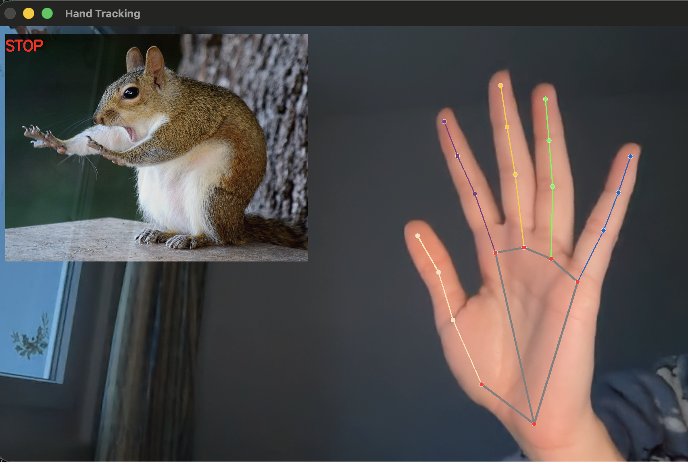
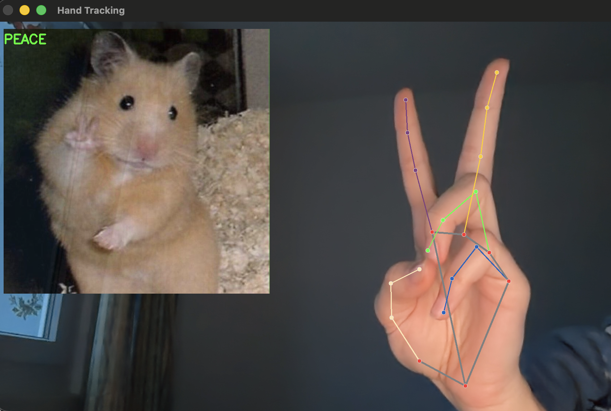
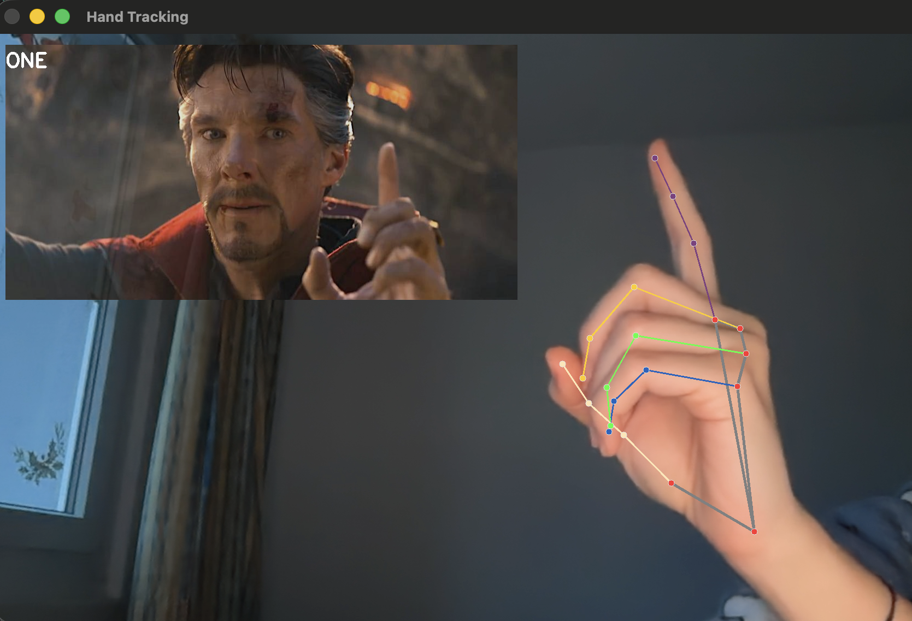
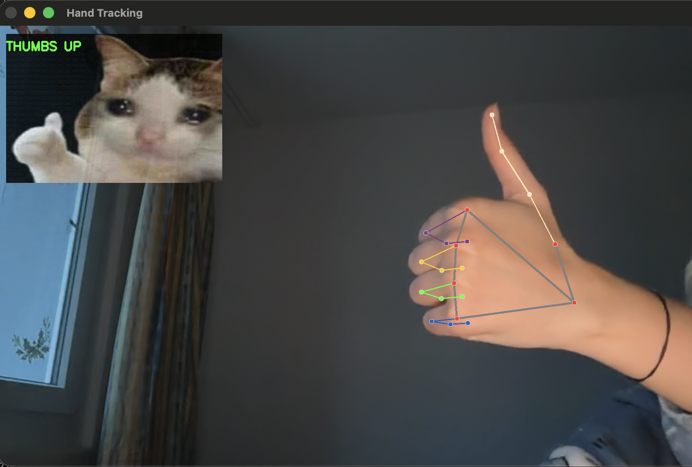
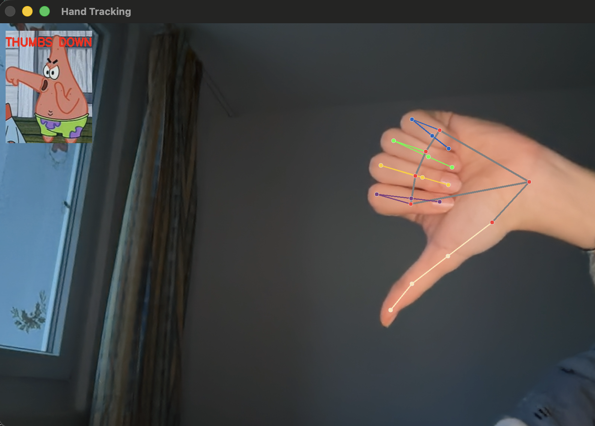

# HandTracking (MediaPipe)

Hand gesture detection using MediaPipe + OpenCV.

## Features
- STOP (open palm)
- PEACE (V sign)
- FIST
- ONE FINGER
- THUMBS UP / DOWN

## Demo screenshots
### STOP

### PEACE

### FIST

### ONE FINGER

### THUMBS UP

### THUMBS DOWN
